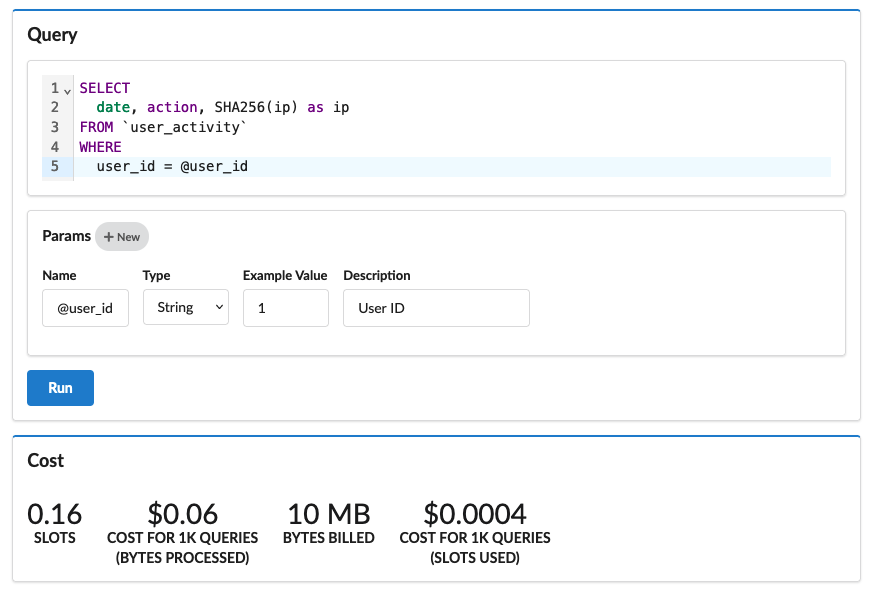
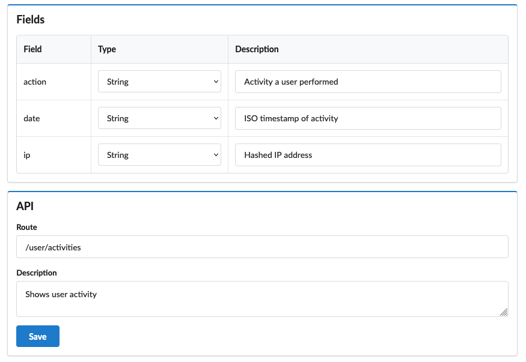
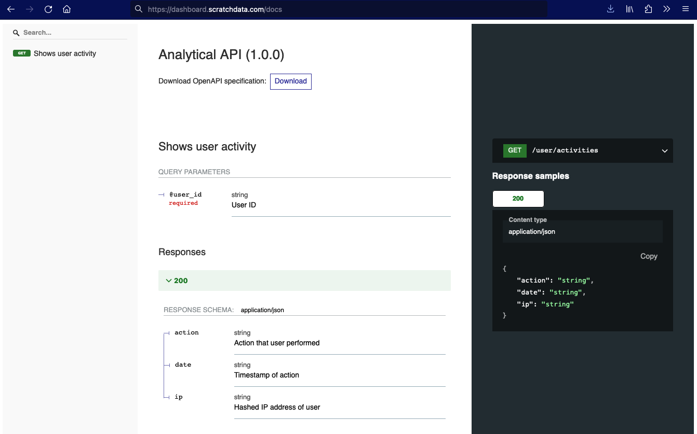
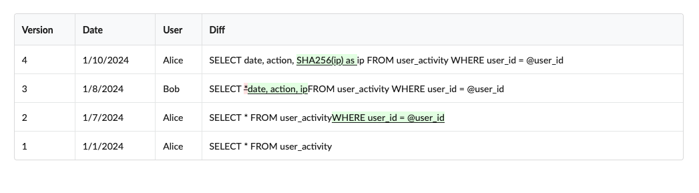

I'm excited to share something we've been working on for some time:
with Scratch, you can transform your analytics database into a realtime API.
You can now safely expose SQL queries with a RESTful endpoint.

It's the missing link between "I have a working SQL query" and 
"how can I get data in front of customers?" Here's how it works:

### Define SQL Queries and See the Cost

The first step is to create a SQL query. Just copy and paste
from your editor. Scratch Data gives you all the metrics you 
need to understand the warehouse usage and cost so you can budget
and optimize before turning it on in production.

We connect to Clickhouse, BigQuery, Redshift, and DuckDB. More connections
are in the works - tell us what you want!

### Document Inputs and Outputs

Set up your query to only return safe data to users. Document
the inputs and outputs of your query. Developers will never see
the underlying table structure or SQL query. They'll only see the
fields that you choose to expose.

### OpenAPI (Swagger) Documentation

Scratch automatically turns your query and documentation into familiar
REST API documentation. 

### Versioning

Easily keep track of the evolution of your endpoint and the underlying
SQL queries with versioning.

## Conclusion

Scratch Data solves the problem of safely exposing analytical insights
to application developers and end-users. Instead of giving them access
to the raw tables, you can write queries to only share the data they need.

Scratch handles all of the operational complexity, from managing the microservice 
to versioning. Better still, everything is completely open-source.
