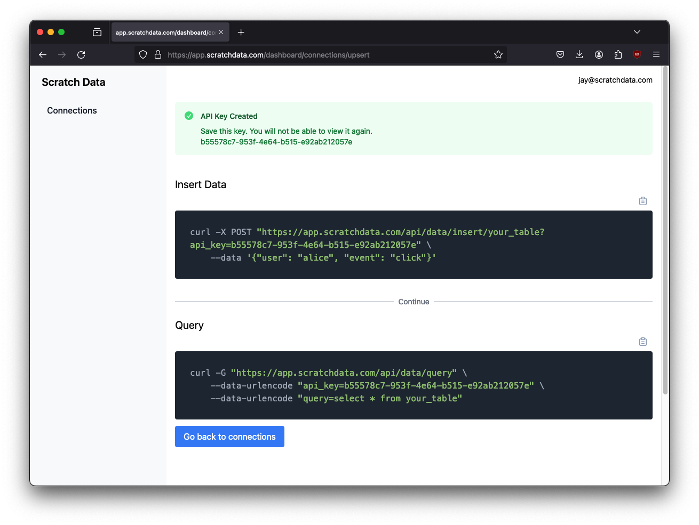

Scratch Data now connects to BigQuery and Redshift! You can now stream data
into and out of your cloud-hosted analytics databases without Kafka, Kinesis,
PubSub, or any of the other complicated data pipeline services.

To get started, all you need to do is enter your connection info.

From there, you'll be given API keys and code to copy and paste to 
stream data in.

As soon as you start streaming data, Scratch will automatically create tables, columns,
and even add additional columns as your schema changes. You can go from zero to a working
integration in minutes.

## Alternatives

If you want to stream data into Redshift without Scratch Data, here is AWS' [official guide](https://docs.aws.amazon.com/redshift/latest/dg/materialized-view-streaming-ingestion-getting-started.html) (944 words.) With BigQuery, you can follow [these steps](https://cloud.google.com/datastream/docs/quickstart-replication-to-bigquery) (2,644 words.)

Godspeed.

## Conclusion

Scratch Data makes it incredibly easy to build applications on top of 
your warehouse. We promise we can get you running - from scratch - 
in literally minutes. Why not [give it a try](https://app.scratchdata.com)? 
