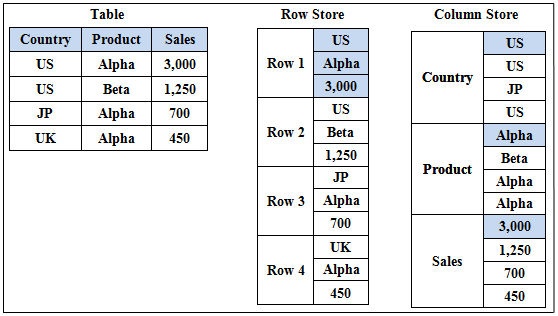

Imagine a developer named Alex, who creates a simple yet intriguing app with a button that shows the user a picture of a cat when they click on it.


Alex chooses PostgreSQL for the backend, confident in its robustness and familiarity. At first, the app functions flawlessly, gaining a steady user base. Each button press generates a record in the database: created_at, user ID, execution time, and the URL of the cat picture. This is a classic case of an Online Transaction Processing system (OLTP), where the focus is on efficient transaction handling, row-based data storage, and quick, isolated data retrieval. Here is the SQL schema:

```sql
CREATE TABLE button_press (
    id SERIAL PRIMARY KEY,
    user_id INTEGER,
    created_at TIMESTAMP,
    execution_time INTEGER,
    cat_url TEXT
);
```

Users love Alex's site. As the app grows in popularity, Alex starts noticing performance issues with the database. He starts experiencing slower query response times when he goes to query the `button_press` table and the database begins to struggle with the heavy load of constantly writing new records.

To address these issues, Alex decides to optimize the database for better performance by adding indexes to the table:

```sql
CREATE INDEX user_id_index ON button_press(user_id);
CREATE INDEX timestamp_index ON button_press(created_at);
CREATE INDEX execution_time_index ON button_press(execution_time_index);
CREATE INDEX cat_url_index ON button_press(cat_url);
```

With these indexes in place, the database can now quickly retrieve specific records by column name, improving query performance significantly. This optimization allows the app to handle a larger number of users and button presses without sacrificing speed or reliability. But the app continues to grow in popularity, and so does the database.

Fast forward a few months, Alex's app goes viral. Suddenly, tens of thousands of users are feverishly clicking the button daily, each click dutifully logged as a new row in the database. The queries meant to aggregate metrics—like average execution time or daily click count—begin to crawl. The indexes that once improved performance are now struggling to keep up with the sheer volume of data. Every write operation requires updating multiple indexes, which slows down the database even further, as well as increasing storage requirements.

It becomes clear to Alex that the indexes aren't going to work long term. Each query has to sift through every single row to calculate the needed statistics, loading vast amounts of data into memory.


This bottleneck is typical in OLTP systems like Postgres when faced with extensive read-heavy analytic queries. These systems are optimized for row-based operations which are ideal for transactional data integrity and speed but not for large-scale data analysis.

Realizing the need for a more efficient way to handle analytics, Alex discovers the realm of Online Analytical Processing (OLAP). Unlike OLTP, OLAP systems are designed for rapid query performance on large datasets, making them ideal for analytics. Alex decides to implement ClickHouse, an OLAP database that stores data in columns rather than rows.



This structural difference is crucial. In a columnar database, each column is stored independently, allowing for faster access during analytical queries that typically only involve a few attributes of the data. For instance, calculating the average execution time of the button press now requires accessing just the execution time column, significantly reducing the data loaded into memory.

By transitioning to ClickHouse for the app's analytical needs, Alex immediately notices improvements. Queries that once took minutes now execute in seconds. Moreover, columnar storage proves to be more space-efficient for Alex’s requirements. Unlike row-based systems that store entire rows together, which often includes redundant or irrelevant data for certain queries, columnar storage focuses only on the relevant data, reducing storage costs.

Operating in the data-driven landscape of digital cat photos, Alex's agility and efficiency are key from him staying relevant and competitive. It can be tricky to onboard data into an OLAP database as they require [bulk inserts](https://clickhouse.com/docs/en/cloud/bestpractices/bulk-inserts) to be performant. If Alex's story resonnates with a problem you have with your data, Scratchdata will help you save time and money. You can schedule some time with Jay, the founder, who will personally help you, or you can start using the managed version of the app [here](https://accounts.google.com/o/oauth2/auth/oauthchooseaccount?client_id=453278616391-s7lhg47d7v7ctrujui58fkfhj78qiktq.apps.googleusercontent.com\&redirect_uri=https%3A%2F%2Fapp.scratchdata.com%2Foauth%2Fgoogle%2Fcallback\&response_type=code\&scope=https%3A%2F%2Fwww.googleapis.com%2Fauth%2Fuserinfo.email\&state=6ad704ef-6c47-4911-a31e-99f118be0805\&service=lso\&o2v=1\&theme=mn\&ddm=0\&flowName=GeneralOAuthFlow).
