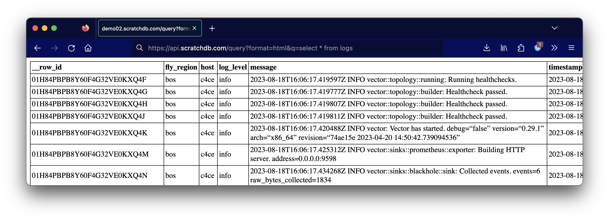

This guide shows how we ship logs into Clickhouse from Fly.io.
It uses ScratchDB (naturally!) which is a tool that automates
Clickhouse devlops and data ingest. To make it work, we configure Fly.io to export logs to ScratchDB's
HTTP endpoint.

## How do I export logs from Fly.io?

Fly.io has a [recipe](https://fly.io/blog/shipping-logs/) 
that uses [Vector](https://vector.dev/) to forward logs. 
To set it up, you need to:

1. Create a new Fly service which forwards logs
2. Specify both a `HTTP_URL` and `HTTP_TOKEN`

Here's how to do it, mostly copied from their docs:

### Set up the Fly Log Shipper

``` bash
# Make a directory for our log shipper app
mkdir logs
cd logs

# Create a new Fly.io app for forwarding logs
fly launch --image ghcr.io/superfly/fly-log-shipper:latest
```

At this point, Fly isn't configured to send logs 
anywhere. We need to set a few environment variables to enable 
log forwarding.

``` bash
# Sets up log forwarding to HTTP endpoint

## Choose your Fly.io org 
fly secrets set ORG=personal

## Give Fly.io permission to read logs 
fly secrets set ACCESS_TOKEN=$(fly auth token)

## Set up the HTTP endpoints
fly secrets set HTTP_URL="https://api.scratchdb.com/data?table=logs"
fly secrets set HTTP_TOKEN="your_api_key"
```

That's it! If you have scratchdb set up,
start seeing logs populated to a logs table.

## How do I view my Fly.io logs?

From here you can query your logs with regular SQL.

``` bash
curl -G https://api.scratchdb.com/query
    -d "format=html"
    -d "q=select * from logs "
    -H 'X-API-KEY: your_api_key'
```

And the output:



## What is ScratchDB?

[ScratchDB](https://github.com/scratchdata/ScratchDB) wraps around Clickhouse.
It is a web server which takes JSON as input and automatically
sets up tables, columns, and populates data. The software is clever about doing
batch asynchronous inserts.

It's also open source. If you don't want to use my hosted version to do this
then you can set it up yourself. JSON logs have a compression ratio of about 10% so
you can get a lot of mileage out of a fairly small database.


## Doesn't Vector already connect to Clickhouse?

Yes! Vector.dev has the [ability](https://vector.dev/docs/reference/configuration/sinks/clickhouse/) 
to send data directly to Clickhouse. The only downsides are that you need to do
(slightly) more sysadmin to set up tables and query. If you wanted to do this, you would:

1. Clone Fly.io's log shipper
2. Create a .toml config for Clickhouse
3. Deploy as a Fly.io app

We don't do that ourselves because we prefer to have a layer in between our database.
It's easier to work with HTTP, and it makes devops easier (for example, we can continue
to ingest logs and queue them for delivery while we upgrade a server.)

## Conclusion and Advertisement

Given that modern hosting no longer has consistent hostnames, IP addresses, or disks,
we don't have many options to manage logs like we used to: with logrotate, webalizer, and grep.

I find Clickhouse to be incredibly useful, but also a little bit painful to set up. I also find
Clickhouse hosting (or log platform hosting) to be expensive and hard to reason about
(how do I estimate the number of "events" - essentially print() statements - being ingested?)

ScratchDB aims to bridge this gap: let you use a regular database via
HTTP calls to do useful things. In this case, it's been working really great for 
capturing logs from Fly.io.

If you want someplace to send your logs, we do it for $0.35/GB compressed. One of our
customers is sending about 1 GB of logs to us a day, which compresses to 50 MB in
Clickhouse. This will cost them a little over $0.50 for the month and gives them full
SQL access to their logs. Not a bad deal!
