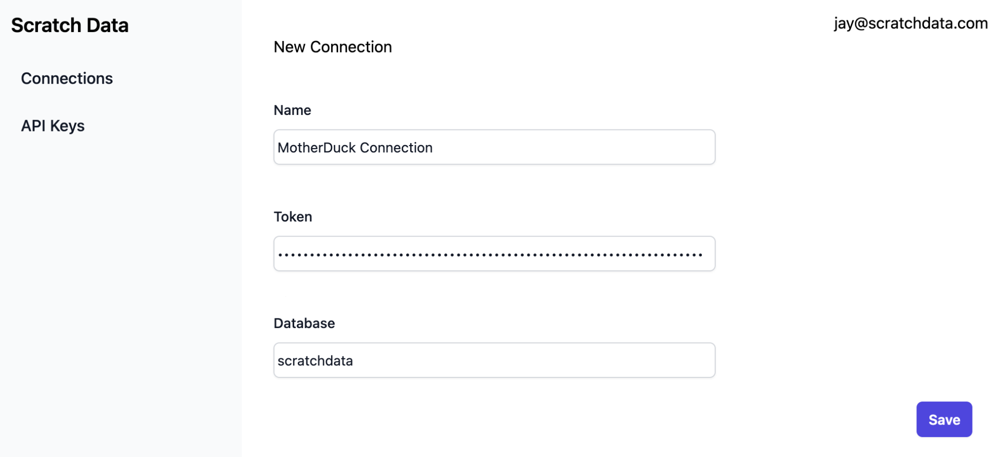
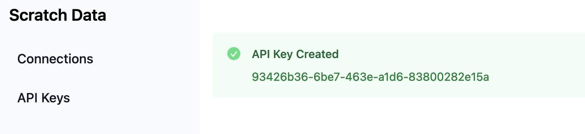
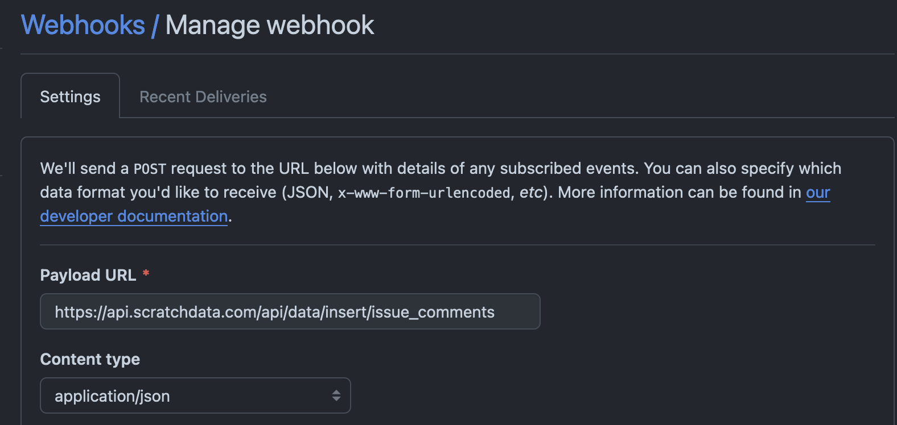

What if you could stream data in real time to MotherDuck? With Scratch Data, you can do exactly that. Scratch lets developers treat their analytics database as a realtime API. It vastly simplifies the work of streaming huge amounts of data into your database.

There are plenty of ways to stream data today, such as Kafka and Kinesis. But they require a lot of configuration - making sure DB schemas are set up, IAM roles, collating data into batches, and jobs to copy data to DuckDB. All of that glue work is a distraction from building.

We’ll start with a simple example: capturing click data with nothing more than a MotherDuck credential.

## How to get started

Getting started is literally as easy as pasting in your MotherDuck credential and making API requests.

### Step 1: Connect Scratch Data to MotherDuck



Once you connect, you’ll be given an API key:



### Step 2: Insert Data

With an API key in hand, you can immediately begin streaming data to MotherDuck. There’s no rate limit and the API returns in milliseconds. Scratch Data will efficiently insert using batches, to minimize 
load on the database.

```
curl -G "https://app.scratchdata.com/api/data/insert/t" \
    --data-urlencode="api_key=..." \
    --data '{"user": "alice", "event": "click"}'
```

That’s it! When you make this API call, Scratch Data automatically creates tables, sets up columns, and copies data into MotherDuck. We didn’t need to set up Kafka, connect to S3, or do any background processing. Send data directly to MotherDuck with zero infrastructure.

### Step 3: Query

From here, you can query your data in MotherDuck’s web interface or in DuckB itself. Your application can also query data as JSON:

```
curl -G "https://app.scratchdata.com/api/data/query" \
    --data-urlencode="api_key=..." \
    --data-urlencode="query=select * from t"
```

JSON is streamed directly from DuckDB itself - you read more about how we do this efficiently in our article on how we use named pipes to stream data.

### Step 4: Share

What if you want to share data with a customer or another team? Scratch Data lets you share results without exposing the underlying structure. Here’s an example of sharing data associated with the user “alice”

```
curl -G "https://app.scratchdata.com/api/data/share" \
    --data-urlencode="api_key=..." \
    --data '{"query": "select * from t where user = 'alice'", "duration": 1000}'
```

And the output:

```
https://app.scratchdata.com/share/90e06aa7-5238-4d46-9484-c088fff59353
```

If users go to that URL, they have an option to download that data to their computer or even download it programmatically.


## Other Applications

There are other clever ways to use this HTTP functionality. One is to use your Scratch Data endpoint a webhook destination. We’ve been able to successfully ingest data from [Stripe](https://scratchdata.com/blog/stripe-data-ingest/), [Shopify](https://scratchdata.com/blog/shopify-data-ingest/), and Github using this technique - very useful know what’s going on in our repo! No need to pay exorbitant fees to sync your data into your own database.




Similarly, you can treat your analytics database as a RESTful API and build customer-facing dashboards or other tools powered by MotherDuck’s fast OLAP engine.

## Realtime Analytics with DuckDB

Everybody speaks REST and we think you should be able to use the tools you already know to use awesome technologies. Scratch Data solves all the headaches related to getting data into and out of your warehouse so you can go back to building.

We’d absolutely love for you to give us a try. Feel free to clone [our repo](https://github.com/scratchdata/scratchdata) and give it a spin. Moreover,  we’re happy to give MotherDuck users a deal. Sign up [here](https://app.scratchdata.com?source=duckdb-blog) and we’ll set you up!