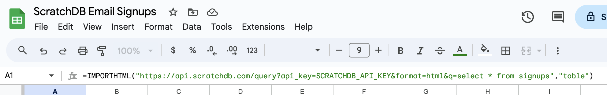

Often I just want to set up a basic form, capture user responses, and view the results
in a spreadsheet. Here's a recipe to do that with ScratchDB. In fact, this is the exact code
we use [on this website](https://github.com/scratchdata/website/blob/main/app.py#L24-L29) for
users who sign up for our beta.

There are a lot of other products that let you capture user surveys, sign-ups, email addresses,
etc. But they all require me to do learn their platform, pick a plan, and do an "integration". 
Wouldn't it be nice to be able to capture data, save it to a SQL database, and view the raw data
in a spreadsheet? 

## How do I send form data to Google Sheets?

On the frontend, you just need a form:

``` html
<form method="POST" action="/signup">
    <input type="text" name="email">
    <input type="submit">
</form>
```

On the backend, pass the data to ScratchDB:

``` py
@app.post("/signup")
def signup():
    email = request.form.get('email', '')
    payload = {'email': email}
    requests.post(
        'https://api.scratchdb.com/data?table=signups', 
        headers={'X-API-KEY': 'SCRATCHDB_API_KEY'}, json=payload)
```

## How do I View Data In a Spreadsheet?

You can use that same URL to directly import data as a table into Google Sheets. To do this, use
the the [IMPORTHTML()](https://support.google.com/docs/answer/3093339?hl=en) function.

```
=IMPORTHTML("https://api.scratchdb.com/query?api_key=SCRATCHDB_API_KEY&format=html&q=select * from signups","table")
```



And that's it! If you have scratchdb set up, you'll start seeing everything populate.

## How does it work?

When you send data to our API, ScratchDB automatially creates a table and populates it with data.
We are using Clickhouse behind the scenes, which is incredibly efficient at storing data. This means
the cost of storing this data is extremely small.

You can execute whatever SQL queries you want on this data and output HTML. That HTML can 
automatically populate a Google Sheet. 

## What is ScratchDB?

[ScratchDB](https://github.com/scratchdata/ScratchDB) wraps around Clickhouse.
It is a web server which takes JSON as input and automatically
sets up tables, columns, and populates data. The software is clever about doing
batch asynchronous inserts.

It's also open source. If you don't want to use my hosted version to do this
then you can set it up yourself. 

## Conclusion and Advertisement

ScratchDB is aimed at making it easy to do the simplest thing: capture data so to analyze in
a spreadsheet later. I try to avoid polluting my production database with these projects.

This is pretty easy With ScratchDB, and it is affordable too - only $0.35/GB of data
(after compression). The goal is to create an easy and convenient way for people to
do analysis without needing to worry about the devops or pricing.
