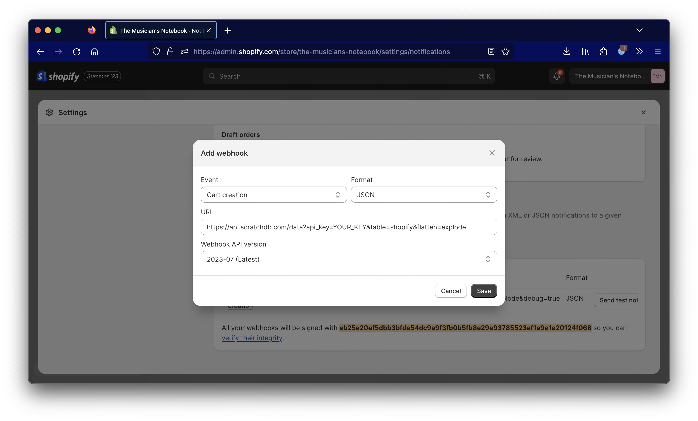

One thing users ahve told us is that Shopify users have trouble exporting all of their
data out of the platform and into a database. We've solved this using Shopify webhooks and 
our tool to ingest data to Clickhouse.

By pasting in a single webhook URL, we will automatically create database tables
and insert Shopify activity to analyze.


## How do I set up Shopify webhooks?

Go to Settings -> Notifications, and then scroll to Webhooks at the bottom of the page. Choose
the event you care about ("Cart creation") and JSON as the format.

From there, enter the following URL:

``` bash
https://api.scratchdb.com/data?api_key=YOUR_KEY&table=shopify&flatten=explode
```

It will look like this:


Hit save and we'll start ingesting data when there is new activity! 

## How do we handle lists?

There are three parameters to specify: the `api_key`, `table`, and `flatten=explode`. Let's focus
on the last one, as this is a unique feature to how we ingest data.

Shopify's webhooks often contain lists. For example:

``` json
{
    "variants": [
        {
        "id": 1,
        "product_id": 5,
        "title": "Default Title",
        "price": "8.17",
        "position": 1,
        },
        {
        "id": 2,
        "product_id": 5,
        "title": "Variant Title",
        "price": "12.17",
        "position": 2,
        }
    ]
}
```

When we specify `explode` as the way we flatten data, we will create two DB rows from this array.
The output will look like this:

```
| variants_id | variants_product_id | variants_price | variants_position |
|-------------|---------------------|----------------|-------------------|
| 1           | 5                   | 8.17           | 1                 |
| 2           | 5                   | 12.17          | 2                 |
```

We do this multiplicatively - we take the cartesian product of all arrays, 
so that every row is a unique combination of array values. To de-duplicate, you can use SQL
depending on your query.

## How do I query data?

The easiest way to get started is via a REST API. You can also query directly using Clickhouse,
Postgres, or MySQL database connectors.

``` bash
https://api.scratchdb.com/query?q=select * from shopify&api_key=YOUR_KEY
```

## What is ScratchDB?

[ScratchDB](https://github.com/scratchdata/ScratchDB) is an open-source 
data warehouse. It completely simplifies the process of ingesting data and
managing servers.

You can send any JSON you want and we automatically create tables based on
what you've sent.

## Conclusion and Advertisement

ScratchDB is aimed at making it easy to do the simplest thing: capture data so to analyze 
later. This example shows how, with a simple webhook, we can have a full Shopify integration
into our data warehouse and analyze all user behavior - from cart creation to product fulfillment - using SQL.
